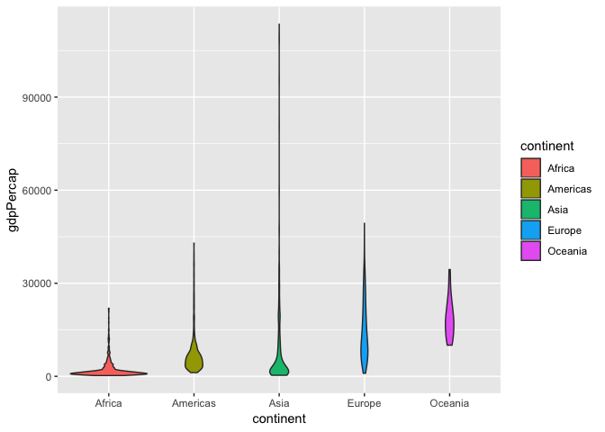
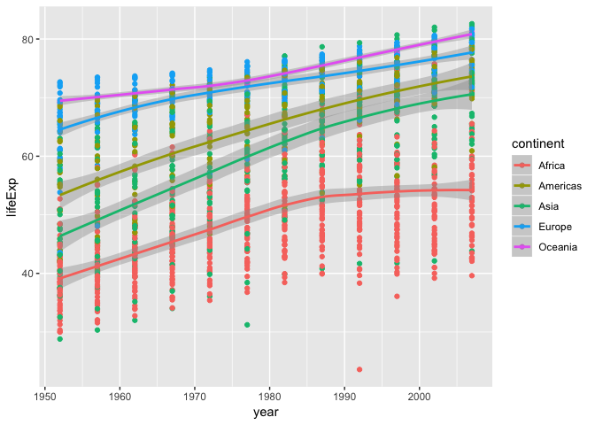

hw03\_Ninadh
================
Ninadh
October 15, 2018

``` r
library(tidyverse)
```

    ## ── Attaching packages ──────────────────────────────────────────────────────────────────────────── tidyverse 1.2.1 ──

    ## ✔ ggplot2 3.0.0     ✔ purrr   0.2.5
    ## ✔ tibble  1.4.2     ✔ dplyr   0.7.6
    ## ✔ tidyr   0.8.1     ✔ stringr 1.3.1
    ## ✔ readr   1.1.1     ✔ forcats 0.3.0

    ## ── Conflicts ─────────────────────────────────────────────────────────────────────────────── tidyverse_conflicts() ──
    ## ✖ dplyr::filter() masks stats::filter()
    ## ✖ dplyr::lag()    masks stats::lag()

``` r
library(dplyr)
library(gapminder)
library(knitr)
```

``` r
gapminder
```

    ## # A tibble: 1,704 x 6
    ##    country     continent  year lifeExp      pop gdpPercap
    ##    <fct>       <fct>     <int>   <dbl>    <int>     <dbl>
    ##  1 Afghanistan Asia       1952    28.8  8425333      779.
    ##  2 Afghanistan Asia       1957    30.3  9240934      821.
    ##  3 Afghanistan Asia       1962    32.0 10267083      853.
    ##  4 Afghanistan Asia       1967    34.0 11537966      836.
    ##  5 Afghanistan Asia       1972    36.1 13079460      740.
    ##  6 Afghanistan Asia       1977    38.4 14880372      786.
    ##  7 Afghanistan Asia       1982    39.9 12881816      978.
    ##  8 Afghanistan Asia       1987    40.8 13867957      852.
    ##  9 Afghanistan Asia       1992    41.7 16317921      649.
    ## 10 Afghanistan Asia       1997    41.8 22227415      635.
    ## # ... with 1,694 more rows

task 1: maximum and minimum GDP per capita for all continents

``` r
gapminder %>%
  group_by(continent) %>%
  summarise(minimum = min(gdpPercap),
            maximum = max(gdpPercap))
```

    ## # A tibble: 5 x 3
    ##   continent minimum maximum
    ##   <fct>       <dbl>   <dbl>
    ## 1 Africa       241.  21951.
    ## 2 Americas    1202.  42952.
    ## 3 Asia         331  113523.
    ## 4 Europe       974.  49357.
    ## 5 Oceania    10040.  34435.

``` r
# figure

gapminder %>%
  group_by(continent) %>%
  ggplot(aes(continent, gdpPercap, fill= continent)) + geom_violin()
```



Task 2: GDP spread within the continents

``` r
gapminder %>%
  group_by(continent) %>%
  summarise(gdpSpread = max(gdpPercap) - min(gdpPercap))
```

    ## # A tibble: 5 x 2
    ##   continent gdpSpread
    ##   <fct>         <dbl>
    ## 1 Africa       21710.
    ## 2 Americas     41750.
    ## 3 Asia        113192.
    ## 4 Europe       48384.
    ## 5 Oceania      24396.

Task 3: Life expectancy changing over time in different continents

| Grammar Component     | Specification |
|-----------------------|---------------|
| **data**              | `gapminder`   |
| **aesthetic mapping** | 'x' & 'y'     |
| **geometric object**  | point         |
| scale                 | linear        |
| statistical transform | none          |

``` r
gapminder %>%
  group_by(continent) %>%
  ggplot(aes(year, lifeExp)) +
  geom_point(aes(colour = continent)) +
  geom_smooth(aes(colour = continent))
```

    ## `geom_smooth()` using method = 'loess' and formula 'y ~ x'



Life expectancy of Oceania &gt; Europe &gt; Americas &gt; Asia &gt; Africa

Task 4: Continents with the number of people who had life expectancy below the mean life expectancy.

``` r
gapminder %>%
  group_by(year, continent) %>%
  summarise(mean_lifeExp = mean(lifeExp), 
            low_lifeExp = sum(lifeExp < mean_lifeExp))
```

    ## # A tibble: 60 x 4
    ## # Groups:   year [?]
    ##     year continent mean_lifeExp low_lifeExp
    ##    <int> <fct>            <dbl>       <int>
    ##  1  1952 Africa            39.1          27
    ##  2  1952 Americas          53.3          12
    ##  3  1952 Asia              46.3          19
    ##  4  1952 Europe            64.4          12
    ##  5  1952 Oceania           69.3           1
    ##  6  1957 Africa            41.3          28
    ##  7  1957 Americas          56.0          12
    ##  8  1957 Asia              49.3          18
    ##  9  1957 Europe            66.7          12
    ## 10  1957 Oceania           70.3           1
    ## # ... with 50 more rows
